# Use Case Diagram - Shopping List App

## Overview
This document provides comprehensive use case diagrams for the Shopping List Application.

## Actors

### Primary Actors
- **👤 Shopper**: Regular user of the application
- **👥 Collaborator**: User invited to shared shopping lists
- **🚶 Guest**: Unauthenticated user

### Secondary Actors (External Systems)
- **🔐 Clerk Auth System**: Authentication service
- **🍳 Spoonacular API**: Recipe service provider
- **📱 Expo Push Service**: Push notification service
- **⏰ System Scheduler**: Cron jobs for automated tasks

---

## Complete Use Case Diagram

```mermaid
flowchart TB
    %% Actors
    Shopper([👤 Shopper])
    Collaborator([👥 Collaborator])
    Guest([🚶 Guest])

    %% External Systems
    Clerk[🔐 Clerk Auth System]
    Spoonacular[🍳 Spoonacular API]
    ExpoPush[📱 Expo Push Service]
    CronJobs[⏰ System Scheduler]

    %% Main System
    subgraph System["📱 Shopping List App System"]

        subgraph Auth["Authentication"]
            SignUp((Sign Up))
            SignIn((Sign In))
            ResetPW((Reset Password))
        end

        subgraph Lists["Shopping Lists"]
            CreateList((Create List))
            EditList((Edit List))
            ViewLists((View Lists))
            ShareList((Share List))
            CompleteShopping((Complete Shopping))
        end

        subgraph Products["Product Management"]
            BrowseCatalog((Browse Catalog))
            AddProduct((Add Product))
            UpdateQty((Update Quantity))
            CheckDupes((Check Duplicates))
            ComparePrices((Compare Prices))
        end

        subgraph Collab["Collaboration"]
            InviteUser((Invite Collaborator))
            AcceptInvite((Accept Invitation))
            RealtimeSync((Real-time Sync))
        end

        subgraph Recipes["Recipes"]
            BrowseRecipes((Browse Recipes))
            ViewRecipe((View Recipe Details))
            AddIngredients((Add Ingredients to List))
        end

        subgraph Notifications["Notifications"]
            ViewNotif((View Notifications))
            ShoppingReminder((Shopping Reminders))
            LowStockAlert((Low Stock Alerts))
        end

        subgraph Analytics["Analytics & Insights"]
            Dashboard((Expense Dashboard))
            Trends((Weekly Trends))
            Recommendations((Get Recommendations))
        end
    end

    %% Shopper connections
    Shopper --> SignUp
    Shopper --> SignIn
    Shopper --> CreateList
    Shopper --> EditList
    Shopper --> ViewLists
    Shopper --> ShareList
    Shopper --> CompleteShopping
    Shopper --> BrowseCatalog
    Shopper --> AddProduct
    Shopper --> UpdateQty
    Shopper --> CheckDupes
    Shopper --> ComparePrices
    Shopper --> InviteUser
    Shopper --> BrowseRecipes
    Shopper --> ViewRecipe
    Shopper --> AddIngredients
    Shopper --> ViewNotif
    Shopper --> Dashboard
    Shopper --> Trends
    Shopper --> Recommendations

    %% Collaborator connections
    Collaborator --> ViewLists
    Collaborator --> AddProduct
    Collaborator --> UpdateQty
    Collaborator --> AcceptInvite
    Collaborator --> RealtimeSync

    %% Guest connections
    Guest --> SignUp
    Guest --> SignIn

    %% External system connections
    SignUp -.->|authenticates via| Clerk
    SignIn -.->|authenticates via| Clerk
    ResetPW -.->|authenticates via| Clerk

    BrowseRecipes -.->|fetches from| Spoonacular
    ViewRecipe -.->|fetches from| Spoonacular
    AddIngredients -.->|uses| Spoonacular

    ShoppingReminder -.->|sends push via| ExpoPush
    LowStockAlert -.->|sends push via| ExpoPush

    ShoppingReminder -.->|triggered by| CronJobs
    LowStockAlert -.->|triggered by| CronJobs
    Recommendations -.->|computed by| CronJobs

    %% Include relationships
    AddProduct -.->|includes| CheckDupes

    %% Extend relationships
    ViewLists -.->|may extend to| ShareList
    AddProduct -.->|may extend to| AddIngredients

    %% Styling
    classDef actorClass fill:#4A90E2,stroke:#2E5C8A,stroke-width:3px,color:#fff,font-weight:bold
    classDef externalClass fill:#FF6B6B,stroke:#C92A2A,stroke-width:2px,color:#fff
    classDef useCaseClass fill:#7ED321,stroke:#5FA015,stroke-width:2px,color:#000

    class Shopper,Collaborator,Guest actorClass
    class Clerk,Spoonacular,ExpoPush,CronJobs externalClass
```

---

## Feature-Specific Diagrams

### Authentication Flow

```mermaid
flowchart LR
    %% Actors
    Shopper([👤 Shopper])
    Guest([🚶 Guest])
    Clerk[🔐 Clerk Auth System]

    subgraph AUTH["🔐 Authentication Module"]
        UC1((Sign Up))
        UC2((Sign In))
        UC3((Sign Out))
        UC4((Reset Password))
        UC5((Enable<br/>Biometric Auth))

        UC1 -.->|includes| ValidateEmail((Validate Email))
        UC2 -.->|includes| CheckAttempts((Check Login<br/>Attempts))
        UC5 -.->|extends| UC2
    end

    %% Connections
    Shopper --> UC2
    Shopper --> UC3
    Shopper --> UC4
    Shopper --> UC5
    Guest --> UC1
    Guest --> UC2

    UC1 -.->|uses| Clerk
    UC2 -.->|uses| Clerk
    UC4 -.->|uses| Clerk

    %% Styling
    classDef actorStyle fill:#4A90E2,stroke:#2E5C8A,stroke-width:3px,color:#fff
    classDef systemStyle fill:#FF6B6B,stroke:#C92A2A,stroke-width:2px,color:#fff
    class Shopper,Guest actorStyle
    class Clerk systemStyle
```

### Shopping List Lifecycle

```mermaid
flowchart TB
    %% Actor
    Shopper([👤 Shopper])
    Collaborator([👥 Collaborator])

    subgraph LIFECYCLE["🛒 Shopping List Lifecycle"]
        direction TB

        UC10((1. Create List))
        UC16((2. Set Budget))
        UC22((3. Add Products))
        UC26{{Check<br/>Duplicates}}
        UC14((4. Share List))
        UC33((5. Real-time<br/>Sync))
        UC25((6. Mark Items<br/>Purchased))
        UC15((7. Complete<br/>Shopping))
        UC60((8. View<br/>Analytics))

        UC10 --> UC16
        UC16 --> UC22
        UC22 --> UC26
        UC26 -.->|no duplicates| UC14
        UC26 -.->|duplicates found| Warning[⚠️ Show Warning]
        Warning --> UC22
        UC14 --> UC33
        UC33 --> UC25
        UC25 --> UC15
        UC15 --> UC60
    end

    %% Connections
    Shopper --> UC10
    Shopper --> UC16
    Shopper --> UC22
    Shopper --> UC14
    Shopper --> UC25
    Shopper --> UC15
    Shopper --> UC60

    Collaborator --> UC22
    Collaborator --> UC33
    Collaborator --> UC25

    %% Styling
    classDef actorStyle fill:#4A90E2,stroke:#2E5C8A,stroke-width:3px,color:#fff
    classDef processStyle fill:#7ED321,stroke:#5FA015,stroke-width:2px
    classDef decisionStyle fill:#F5A623,stroke:#D68910,stroke-width:2px
    classDef warningStyle fill:#FF6B6B,stroke:#C92A2A,stroke-width:2px,color:#fff

    class Shopper,Collaborator actorStyle
    class UC10,UC16,UC22,UC14,UC33,UC25,UC15,UC60 processStyle
    class UC26 decisionStyle
    class Warning warningStyle
```

### Recipe Integration

```mermaid
flowchart LR
    %% Actor and External System
    Shopper([👤 Shopper])
    Spoonacular[🍳 Spoonacular API]

    subgraph RECIPES["🍽️ Recipe Integration"]
        direction TB

        UC40((Browse<br/>Recipes))
        UC41((Search<br/>Recipes))
        UC42((View Recipe<br/>Details))
        UC43((Add Ingredients<br/>to List))

        Match{{Match to<br/>Product<br/>Catalog}}

        UC40 --> UC42
        UC41 --> UC42
        UC42 --> UC43
        UC43 --> Match
        Match -.->|matched| AddExisting((Add Existing<br/>Products))
        Match -.->|not matched| CreateCustom((Create Custom<br/>Products))
    end

    %% Connections
    Shopper --> UC40
    Shopper --> UC41

    UC40 -.->|fetches| Spoonacular
    UC41 -.->|fetches| Spoonacular
    UC42 -.->|fetches| Spoonacular

    %% Styling
    classDef actorStyle fill:#4A90E2,stroke:#2E5C8A,stroke-width:3px,color:#fff
    classDef systemStyle fill:#FF6B6B,stroke:#C92A2A,stroke-width:2px,color:#fff
    classDef processStyle fill:#7ED321,stroke:#5FA015,stroke-width:2px
    classDef decisionStyle fill:#F5A623,stroke:#D68910,stroke-width:2px

    class Shopper actorStyle
    class Spoonacular systemStyle
    class UC40,UC41,UC42,UC43,AddExisting,CreateCustom processStyle
    class Match decisionStyle
```

### Notification System

```mermaid
flowchart TB
    %% Actors
    Shopper([👤 Shopper])
    CronJobs[⏰ Cron Jobs]
    ExpoPush[📱 Expo Push]

    subgraph NOTIF["🔔 Notification System"]
        direction TB

        subgraph TRIGGERS["Notification Triggers"]
            T1[Hourly:<br/>Check Shopping<br/>Schedules]
            T2[Daily:<br/>Analyze<br/>Stock Levels]
            T3[Weekly:<br/>Update<br/>Trends]
        end

        subgraph TYPES["Notification Types"]
            UC52((Shopping<br/>Reminders))
            UC53((Low Stock<br/>Alerts))
            N1((Price Drop<br/>Alerts))
            N2((List Shared<br/>Updates))
        end

        subgraph USER["User Actions"]
            UC50((View<br/>Notifications))
            UC51((Configure<br/>Settings))
            MarkRead((Mark as<br/>Read))
            Delete((Delete))
        end

        T1 --> UC52
        T2 --> UC53
        T3 --> N1

        UC52 --> SaveDB[(Save to<br/>MongoDB)]
        UC53 --> SaveDB
        N1 --> SaveDB
        N2 --> SaveDB

        SaveDB --> SendPush[Send Push<br/>Notification]
        SendPush --> UC50

        UC50 --> MarkRead
        UC50 --> Delete
    end

    %% Connections
    Shopper --> UC50
    Shopper --> UC51

    CronJobs -.->|triggers| T1
    CronJobs -.->|triggers| T2
    CronJobs -.->|triggers| T3

    SendPush -.->|sends via| ExpoPush

    %% Styling
    classDef actorStyle fill:#4A90E2,stroke:#2E5C8A,stroke-width:3px,color:#fff
    classDef systemStyle fill:#FF6B6B,stroke:#C92A2A,stroke-width:2px,color:#fff
    classDef triggerStyle fill:#9B59B6,stroke:#6C3483,stroke-width:2px,color:#fff
    classDef notifStyle fill:#F5A623,stroke:#D68910,stroke-width:2px
    classDef userStyle fill:#7ED321,stroke:#5FA015,stroke-width:2px
    classDef dbStyle fill:#95A5A6,stroke:#7F8C8D,stroke-width:2px

    class Shopper actorStyle
    class CronJobs,ExpoPush systemStyle
    class T1,T2,T3 triggerStyle
    class UC52,UC53,N1,N2 notifStyle
    class UC50,UC51,MarkRead,Delete userStyle
    class SaveDB,SendPush dbStyle
```

### ML Recommendation Engine

```mermaid
flowchart TB
    %% Actor
    Shopper([👤 Shopper])
    CronJobs[⏰ Cron Jobs]

    subgraph RECOMMEND["💡 Recommendation Engine"]
        direction TB

        UC70((Get<br/>Recommendations))

        subgraph SCORING["Scoring Algorithm"]
            S1[Personal History<br/>35%]
            S2[Seasonal Products<br/>20%]
            S3[Location-based<br/>15%]
            S4[Collaborative Filter<br/>20%]
            S5[Trending Products<br/>10%]
        end

        subgraph DATA["Data Sources"]
            D1[(Purchase<br/>History)]
            D2[(Product<br/>Seasonality)]
            D3[(Location<br/>Stats)]
            D4[(User<br/>Similarity)]
            D5[(Product<br/>Trends)]
        end

        Aggregate{{Aggregate<br/>Scores}}
        Sort[Sort by<br/>Total Score]
        Top10[Return<br/>Top 10]

        UC70 --> S1 & S2 & S3 & S4 & S5

        S1 --> D1
        S2 --> D2
        S3 --> D3
        S4 --> D4
        S5 --> D5

        D1 & D2 & D3 & D4 & D5 --> Aggregate
        Aggregate --> Sort
        Sort --> Top10
        Top10 --> Display[Display to<br/>User]
    end

    %% Connections
    Shopper --> UC70
    CronJobs -.->|updates weekly| D5
    CronJobs -.->|recalculates| D4

    %% Styling
    classDef actorStyle fill:#4A90E2,stroke:#2E5C8A,stroke-width:3px,color:#fff
    classDef systemStyle fill:#FF6B6B,stroke:#C92A2A,stroke-width:2px,color:#fff
    classDef scoreStyle fill:#9B59B6,stroke:#6C3483,stroke-width:2px,color:#fff
    classDef dataStyle fill:#95A5A6,stroke:#7F8C8D,stroke-width:2px,color:#fff
    classDef processStyle fill:#7ED321,stroke:#5FA015,stroke-width:2px

    class Shopper actorStyle
    class CronJobs systemStyle
    class S1,S2,S3,S4,S5 scoreStyle
    class D1,D2,D3,D4,D5 dataStyle
    class UC70,Aggregate,Sort,Top10,Display processStyle
```

---

## Use Case Summary Table

| ID | Use Case | Actor | Description | Priority | Files |
|----|----------|-------|-------------|----------|-------|
| **AUTHENTICATION** |
| UC01 | Sign Up | Guest | Create new user account | High | `client/app/(auth)/sign-up.tsx` |
| UC02 | Sign In | Guest, Shopper | Authenticate user | High | `client/app/(auth)/index.tsx` |
| UC03 | Sign Out | Shopper | End user session | Medium | `client/app/(index)/(tabs)/profile.tsx` |
| UC04 | Reset Password | Guest, Shopper | Recover account access | Medium | `client/app/(auth)/reset-password.tsx` |
| UC05 | Enable Biometric Auth | Shopper | Setup fingerprint/face ID | Low | `client/utils/securityUtils.ts` |
| **SHOPPING LISTS** |
| UC10 | Create Shopping List | Shopper | Create new shopping list | High | `client/app/(index)/(tabs)/shopping-lists.tsx` |
| UC11 | Edit Shopping List | Shopper | Modify list details | High | `client/app/(index)/list/[listId]/edit.tsx` |
| UC12 | Delete Shopping List | Shopper | Remove list permanently | Medium | `client/app/(index)/(tabs)/shopping-lists.tsx` |
| UC13 | View Shopping Lists | Shopper, Collaborator | Browse all lists | High | `client/app/(index)/(tabs)/shopping-lists.tsx` |
| UC14 | Share Shopping List | Shopper | Invite collaborators | Medium | `client/app/(index)/list/[listId]/share.tsx` |
| UC15 | Complete Shopping | Shopper | Mark list as completed | High | `client/app/(index)/list/[listId]/index.tsx` |
| UC16 | Set Budget | Shopper | Define spending limit | Medium | `client/stores/ShoppingListStore.tsx` |
| UC17 | Schedule Shopping Date | Shopper | Set shopping date/time | Medium | `client/stores/ShoppingListStore.tsx` |
| **PRODUCTS** |
| UC20 | Browse Product Catalog | Shopper | Explore available products | High | `client/app/(index)/(tabs)/product-browser.tsx` |
| UC21 | Search Products | Shopper | Find specific products | High | `client/app/(index)/(tabs)/product-browser.tsx` |
| UC22 | Add Product to List | Shopper, Collaborator | Add item to shopping list | High | `client/app/(index)/list/[listId]/index.tsx` |
| UC23 | Remove Product | Shopper, Collaborator | Delete item from list | High | `client/components/ShoppingListProductItem.tsx` |
| UC24 | Update Quantity | Shopper, Collaborator | Change product amount | High | `client/stores/ShoppingListStore.tsx` |
| UC25 | Mark as Purchased | Shopper, Collaborator | Check off bought items | High | `client/components/ShoppingListProductItem.tsx` |
| UC26 | Check for Duplicates | System | Detect duplicate products | Medium | `client/services/DuplicateDetectionService.ts` |
| UC27 | Compare Store Prices | Shopper | View price differences | Low | `server/src/routes/products.ts` |
| **COLLABORATION** |
| UC30 | Invite Collaborator | Shopper | Add user to shared list | Medium | `client/app/(index)/list/[listId]/share.tsx` |
| UC31 | Accept Invitation | Collaborator | Join shared list | Medium | `client/app/(index)/(tabs)/shopping-lists.tsx` |
| UC32 | View Shared Lists | Collaborator | See lists shared with me | Medium | `client/app/(index)/(tabs)/shopping-lists.tsx` |
| UC33 | Real-time Sync | System | Sync changes across devices | High | `server/src/syncServer.ts` |
| **RECIPES** |
| UC40 | Browse Recipe Suggestions | Shopper | View recommended recipes | Low | `client/components/RecipeSuggestionsModal.tsx` |
| UC41 | Search Recipes | Shopper | Find specific recipes | Low | `server/src/services/recipeService.ts` |
| UC42 | View Recipe Details | Shopper | See ingredients & instructions | Low | `client/components/RecipeSuggestionsModal.tsx` |
| UC43 | Add Recipe Ingredients | Shopper | Add recipe items to list | Low | `client/components/RecipeSection.tsx` |
| **NOTIFICATIONS** |
| UC50 | View Notifications | Shopper | See all notifications | Medium | `client/components/NotificationBell.tsx` |
| UC51 | Configure Notification Settings | Shopper | Manage preferences | Low | `client/app/(index)/notification-settings.tsx` |
| UC52 | Shopping Reminders | System | Alert before shopping date | Medium | `server/src/jobs/notificationCronJobs.ts` |
| UC53 | Low Stock Alerts | System | Notify of depleted items | Medium | `server/src/jobs/notificationCronJobs.ts` |
| **ANALYTICS** |
| UC60 | View Expense Dashboard | Shopper | See spending overview | Low | `client/components/Dashboard/` |
| UC61 | View Weekly Trends | Shopper | Analyze purchase patterns | Low | `client/components/Dashboard/` |
| UC62 | View Budget Analysis | Shopper | Compare budget vs actual | Low | `client/components/BudgetSummary.tsx` |
| **RECOMMENDATIONS** |
| UC70 | Get Personalized Recommendations | Shopper | Receive product suggestions | Medium | `server/src/services/recommendationService.ts` |
| UC71 | View Trending Products | Shopper | See popular items | Low | `server/src/models/ml.ts` |
| UC72 | View Seasonal Products | Shopper | See seasonal items | Low | `server/src/models/ml.ts` |

---

## Relationships

### Include Relationships
- **Add Product** includes **Check for Duplicates**
- **Create List** includes **Set Budget**

### Extend Relationships
- **Enable Biometric Auth** extends **Sign In**
- **View Shared Lists** extends **View Lists**
- **Add Recipe Ingredients** extends **Add Product**

### Uses Relationships (External Systems)
- **Sign Up/In/Reset Password** uses **Clerk Auth System**
- **Browse/Search/View Recipes** uses **Spoonacular API**
- **Shopping Reminders/Low Stock Alerts** uses **Expo Push Service**
- **All Automated Notifications** triggered by **System Scheduler**

---

## How to View These Diagrams

### Option 1: GitHub (Automatic Rendering)
GitHub automatically renders Mermaid diagrams in markdown files. Just view this file on GitHub!

### Option 2: Mermaid Live Editor
1. Go to https://mermaid.live/
2. Copy any diagram code above
3. Paste in the editor
4. Export as PNG/SVG

### Option 3: VS Code Extension
1. Install "Markdown Preview Mermaid Support" extension
2. Open this file in VS Code
3. Click "Open Preview" (Ctrl+Shift+V)

### Option 4: Documentation Sites
Works natively in:
- GitBook
- Docusaurus
- MkDocs
- VuePress

---

## References

- [Mermaid Documentation](https://mermaid.js.org/)
- [Use Case Diagram Best Practices](https://www.uml-diagrams.org/use-case-diagrams.html)
- [UML Use Case Relationships](https://www.visual-paradigm.com/guide/uml-unified-modeling-language/use-case-diagram-relationships/)
